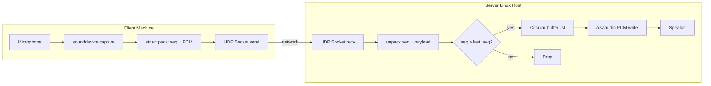
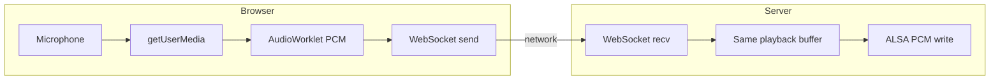

# Design Document: RPi Audio Stream

## Overview

A minimal UDP audio streaming system: two standalone Python scripts — a server (`audio_server.py`) and a client (`audio_client.py`), plus a built-in web test page. No classes. Just functions and module-level state. Each script is self-contained and under 200 lines.

The system prioritizes simplicity and low resource usage. No codecs, no handshakes, no acknowledgments. The client sends numbered UDP packets containing raw PCM; the server plays them in order, dropping anything that arrives late. A browser-based test page is served by the server itself for quick verification without installing client software.

### Key Design Decisions

- **No classes**: Pure functions and module-level variables. The server exposes `start()` and `stop()` functions for integration.
- **Two files only**: `audio_server.py` (server + protocol + buffer logic + WebSocket + HTTP all in one) and `audio_client.py` (client). No shared library files.
- **UDP with no handshake**: Sessions detected implicitly by incoming packets.
- **Single thread for receive + playback**: One dedicated thread runs the receive-and-play loop. ALSA `write()` provides backpressure/timing.
- **Fixed-size list as circular buffer**: A plain Python list with read/write indices. No ring buffer library.
- **pyalsaaudio for ALSA** (server): Thin C binding, `pip install pyalsaaudio`. Only external server dependency.
- **sounddevice for client capture**: Cross-platform mic capture. Only external client dependency.

## Architecture



## File Structure

```
audio_server.py   # Server: UDP recv → buffer → ALSA playback (+ start/stop API + WebSocket + HTTP)
audio_client.py   # Client: mic capture → UDP send
test_page.html    # Inline in audio_server.py as a string, served via HTTP
README.md         # Setup and usage documentation
```

## Server: `audio_server.py`

All logic in one file. No classes. Module-level state for the running server instance.

### Public API (for integration into larger server)

```python
def start(
    port: int = 4000,
    sample_rate: int = 16000,
    chunk_size: int = 1024,
    buffer_chunks: int = 20,
    alsa_device: str = "default",
) -> None:
    """Open ALSA device, bind UDP socket, start receiver thread."""

def stop() -> None:
    """Stop receiver thread, close ALSA device and socket. Returns within 1s."""

def is_running() -> bool:
    """True if the server is actively listening."""
```

### Internal Functions

```python
# Protocol
def pack_chunk(seq: int, payload: bytes) -> bytes:
    """4-byte big-endian uint32 seq + raw PCM payload."""

def unpack_chunk(data: bytes) -> tuple[int, bytes]:
    """Parse datagram into (seq, payload). Raises ValueError if < 4 bytes."""

# Buffer (operates on module-level list + indices)
def buffer_write(data: bytes) -> None:
    """Write chunk to circular buffer. Overwrites oldest if full."""

def buffer_read() -> bytes | None:
    """Read next chunk or None if empty."""

def buffer_clear() -> None:
    """Reset buffer to empty."""

def buffer_count() -> int:
    """Number of chunks currently in buffer."""

# Main loop
def _recv_loop() -> None:
    """Receive UDP → parse → order check → buffer → ALSA write. Runs in thread."""
```

### Module-Level State

```python
_sock: socket.socket | None = None
_alsa_dev = None  # alsaaudio.PCM instance
_thread: threading.Thread | None = None
_running = False
_last_seq = -1
_last_packet_time = 0.0

# Buffer state
_buf: list[bytes] = []
_buf_capacity = 20
_buf_read_idx = 0
_buf_write_idx = 0
_buf_count = 0

# Config (set by start())
_chunk_size = 1024
_sample_rate = 16000
_session_timeout = 5.0
```

### Server Main Loop Pseudocode

```
while _running:
    try:
        data = _sock.recv(4 + _chunk_size + 64)  # slight oversize for safety
    except socket.timeout:
        if time.time() - _last_packet_time > _session_timeout and _last_seq >= 0:
            reset session
        continue

    seq, payload = unpack_chunk(data)
    if seq <= _last_seq:
        continue  # drop out-of-order/duplicate

    _last_seq = seq
    _last_packet_time = time.time()
    buffer_write(payload)

    chunk = buffer_read()
    if chunk:
        _alsa_dev.write(chunk)
    # If buffer empty for >200ms, write silence (handled by timeout path)
```

## Client: `audio_client.py`

Self-contained script. Uses `sounddevice` for mic capture, `struct` for packing, `socket` for UDP.

```python
def main():
    parser = argparse.ArgumentParser()
    parser.add_argument("host")
    parser.add_argument("port", type=int)
    parser.add_argument("--sample-rate", type=int, default=16000)
    parser.add_argument("--chunk-size", type=int, default=1024)
    args = parser.parse_args()

    seq = 0
    sock = socket.socket(socket.AF_INET, socket.SOCK_DGRAM)

    def callback(indata, frames, time_info, status):
        nonlocal seq
        payload = indata[:, 0].tobytes()  # mono channel
        sock.sendto(pack_chunk(seq, payload), (args.host, args.port))
        seq = (seq + 1) % (2**32)

    with sd.InputStream(samplerate=args.sample_rate, channels=1,
                        dtype='int16', blocksize=args.chunk_size // 2,
                        callback=callback):
        print(f"Streaming to {args.host}:{args.port} — Ctrl+C to stop")
        while True:
            time.sleep(0.1)
```

The client includes its own copy of `pack_chunk` (3 lines) to stay fully self-contained.

## Web Test Interface

Built into `audio_server.py`. No extra files — the HTML is an inline string served by Python's `http.server`.

### How It Works

- The server starts a simple HTTP server (stdlib `http.server.HTTPServer`) on a configurable port (default 8080) that serves a single HTML page.
- The HTML page uses `getUserMedia` to capture the browser's mic, processes it via `AudioWorklet` or `ScriptProcessorNode` to get raw PCM int16 mono samples, and sends them over a WebSocket connection.
- The server runs a basic WebSocket handler (hand-rolled using stdlib `socket` — no `websockets` library needed) on a configurable port (default 4001). Received WebSocket frames are unpacked and fed into the same `buffer_write()` → ALSA playback pipeline as UDP chunks.
- The WebSocket handler is minimal: just enough to do the handshake and read binary frames. No ping/pong, no fragmentation support needed for this use case.

### Additional Public API

```python
def start_web(
    http_port: int = 8080,
    ws_port: int = 4001,
) -> None:
    """Start HTTP server for test page and WebSocket receiver. Call after start()."""

def stop_web() -> None:
    """Stop HTTP and WebSocket servers."""
```

### Test Page Features

- Start/Stop button to toggle mic streaming
- Connection status indicator (connected/disconnected)
- Displays the server's UDP port and WebSocket port for reference
- All inline — single HTML string, no external CSS/JS dependencies

### Architecture Addition



## Data Models

### Audio Chunk Wire Format

```
+-------------------+----------------------------+
| Sequence Number   | PCM Payload                |
| 4 bytes (uint32)  | chunk_size bytes (raw PCM) |
| big-endian        | 16-bit signed LE samples   |
+-------------------+----------------------------+
```

### Server Configuration

| Parameter      | Type | Default   | Description                         |
|----------------|------|-----------|-------------------------------------|
| port           | int  | 4000      | UDP listen port                     |
| sample_rate    | int  | 16000     | PCM sample rate in Hz               |
| chunk_size     | int  | 1024      | Payload size in bytes per chunk     |
| buffer_chunks  | int  | 20        | Number of chunks in circular buffer |
| alsa_device    | str  | "default" | ALSA device name                    |

## Correctness Properties

### Property 1: Audio chunk serialization round-trip

*For any* valid sequence number (0 to 2^32-1) and any raw PCM payload of the configured chunk size, `pack_chunk` followed by `unpack_chunk` shall produce the same sequence number and identical payload bytes.

**Validates: Requirements 7.5, 7.1**

### Property 2: Out-of-order chunk rejection

*For any* stream of sequence numbers, the ordering logic shall only accept chunks whose sequence number is strictly greater than the last accepted sequence number, dropping all others.

**Validates: Requirements 1.5, 7.2**

## Error Handling

| Scenario | Behavior |
|----------|----------|
| Invalid datagram (< 4 bytes) | Log warning, drop, continue |
| ALSA device open failure | Raise exception from `start()` |
| ALSA write error | Log error, continue if possible |
| Socket bind failure | Raise exception from `start()` |
| Client mic access failure | Print error, exit non-zero |
| Receiver thread exception | Log error, set `_running = False`, clean up |

## Testing Strategy

### Property-Based Tests

Use `hypothesis`. Only two property tests targeting pure functions with no hardware dependencies:

| Test | Target | Property |
|------|--------|----------|
| `test_chunk_round_trip` | `pack_chunk`/`unpack_chunk` in `audio_server.py` | Property 1 |
| `test_out_of_order_rejection` | ordering logic extracted as a pure function | Property 2 |

### What Is NOT Tested

- ALSA playback, network integration, mic capture, performance — all verified manually on target hardware.
