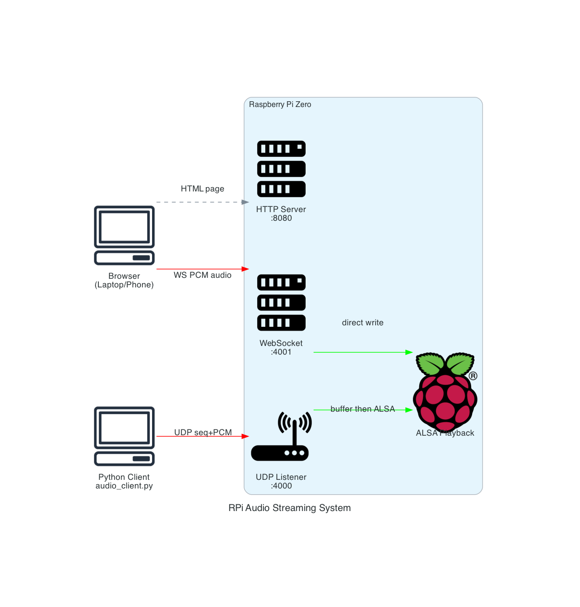

# RPi Audio Stream

Lightweight UDP audio streaming for Linux/ALSA. Captures microphone audio on a client device and plays it back in real-time on a Linux host. Designed for the Raspberry Pi Zero but works on any Linux system with ALSA.

Two files, no classes, minimal dependencies. The server receives raw PCM over UDP and writes it to ALSA. A browser-based test page is built in for quick verification.

## System Architecture



The editable diagram is at [`diagrams/rpi_audio_streaming_system.drawio`](diagrams/rpi_audio_streaming_system.drawio) (open with [draw.io](https://app.diagrams.net)).

## Quickstart — Web Test Interface

The fastest way to try it out. Stream audio from your phone or laptop browser to the Pi's speaker, no client install needed.

```bash
# On the Pi
sudo apt-get install libasound2-dev
python3 -m venv .venv && source .venv/bin/activate
pip install -r requirements.txt

# Start the server with the web interface
python3 -c "
import audio_server
audio_server.start()
audio_server.start_web()
print('Open http://<pi-ip>:8080 in your browser')
import time
try:
    while True: time.sleep(1)
except KeyboardInterrupt:
    audio_server.stop_web()
    audio_server.stop()
"
```

Then open `http://<your-pi-ip>:8080` on your laptop, click Start, and speak into the mic. Audio plays through the Pi's speaker. Ctrl+C on the Pi to stop.

## Installation

Requires Python 3.7+.

**Server** (Linux only — needs ALSA headers):

```bash
sudo apt-get install libasound2-dev
pip install -r requirements.txt
```

Or install individually:

```bash
sudo apt-get install libasound2-dev
pip install pyalsaaudio
pip install sounddevice
```

## Usage

### Standalone Server

```python
import audio_server

# Start with defaults (port=4000, 16kHz, 1024-byte chunks)
audio_server.start()

# Or customize everything
audio_server.start(
    port=4000,
    sample_rate=16000,
    chunk_size=1024,
    buffer_chunks=20,
    alsa_device="default",
)

# Server runs in a background thread — your code continues here
# ...

audio_server.stop()
```

### Python Client

```bash
# Basic usage
python audio_client.py <server-ip> 4000

# Custom sample rate and chunk size
python audio_client.py <server-ip> 4000 --sample-rate 16000 --chunk-size 1024
```

The client captures your default microphone and streams raw PCM to the server. Press Ctrl+C to stop.

### Web Test Interface

No client install needed — stream audio directly from a browser.

```python
import audio_server

# Start the audio server first
audio_server.start()

# Then start the web interface
audio_server.start_web(http_port=8080, ws_port=4001)

# Open http://<server-ip>:8080 in your browser
# Click Start to begin streaming, Stop to end

# Clean up
audio_server.stop_web()
audio_server.stop()
```

The test page captures your browser's microphone via `getUserMedia`, encodes it as raw PCM, and sends it over WebSocket to the server.

### Browser Microphone Permission (HTTPS)

Chrome and most browsers only allow microphone access on secure origins. Since the server uses plain HTTP for lowest latency (no TLS overhead on Pi Zero), you need to allowlist the Pi's address in Chrome:

1. Open `chrome://flags/#unsafely-treat-insecure-origin-as-secure`
2. Paste `http://<pi-ip>:8080` (e.g. `http://192.168.0.55:8080`)
3. Set the dropdown to "Enabled"
4. Click "Relaunch"

Or launch Chrome from the command line (macOS):

```bash
/Applications/Google\ Chrome.app/Contents/MacOS/Google\ Chrome \
  --unsafely-treat-insecure-origin-as-secure="http://192.168.0.55:8080"
```

## Configurable Parameters

### Server (`audio_server.start()`)

| Parameter | Default | Description |
|-----------|---------|-------------|
| `port` | `4000` | UDP listen port |
| `sample_rate` | `16000` | PCM sample rate in Hz |
| `chunk_size` | `1024` | Payload size in bytes per chunk |
| `buffer_chunks` | `20` | Number of chunks in circular buffer |
| `alsa_device` | `"default"` | ALSA device name |

### Web Interface (`audio_server.start_web()`)

| Parameter | Default | Description |
|-----------|---------|-------------|
| `http_port` | `8080` | HTTP server port for the test page |
| `ws_port` | `4001` | WebSocket port for browser audio |

### Client CLI (`audio_client.py`)

| Argument | Default | Description |
|----------|---------|-------------|
| `host` | *(required)* | Server IP address or hostname |
| `port` | *(required)* | Server UDP port |
| `--sample-rate` | `16000` | Sample rate in Hz |
| `--chunk-size` | `1024` | Payload size in bytes |

## Integration Guide

The server is designed to embed into a larger application (e.g., a robot controller running webcam streaming and motor controls alongside audio).

```python
import audio_server

# 1. Start the audio server with your preferred config
audio_server.start(port=4000, sample_rate=16000, alsa_device="default")

# 2. Optionally enable the browser test page
audio_server.start_web(http_port=8080, ws_port=4001)

# 3. Run your own application logic — the server won't block
#    It runs in background threads.
run_my_app()

# 4. Clean up when shutting down
audio_server.stop_web()
audio_server.stop()
```

Key points:

- `start()` launches a background thread for the UDP receive/playback loop. It won't block your main loop.
- `start_web()` adds two more background threads (HTTP + WebSocket). Call it after `start()`.
- `stop()` and `stop_web()` release all resources (ALSA device, sockets) within 1 second.
- `is_running()` returns `True` while the server is active.
- The only external server dependency is `pyalsaaudio`. Everything else is Python stdlib.

### Example: Embedding in a Flask App

```python
from flask import Flask
import audio_server

app = Flask(__name__)

@app.before_first_request
def init_audio():
    audio_server.start(port=4000)
    audio_server.start_web(http_port=8080)

import atexit
atexit.register(audio_server.stop_web)
atexit.register(audio_server.stop)
```

## Audio Format

All audio is raw PCM: 16-bit signed little-endian, mono, at the configured sample rate. Each UDP packet is a 4-byte big-endian sequence number followed by the PCM payload. No codec, no compression.

## License

See LICENSE file for details.
